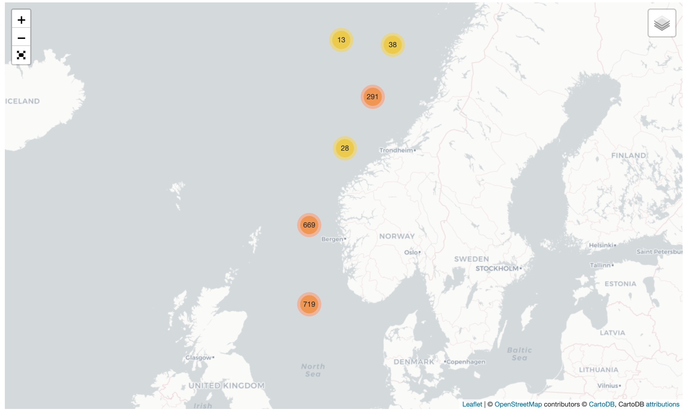

# flask-folium-app
By developing this app, we wished to accomplish the following:

1. Create a version 1 of an interactive well map with Folium. Possibility to add new features and functionalities to the map.

2. Gain experience with the full path from a Jupyter Notebook, to a Flask app, to deployment.

# Project description
The well data maps shows the position of all exploration wellbores on the Norwegian shelf. Wellbores are grouped into clusters when zooming out. By clicking on a wellbore position, a popup comes up with additional information. 

 
    
    
    
 

Additionally, there is a contact form where users can contact us with comments/suggestions.

# Data
The dataset is in the form of a shapefile which is publicly hosted by the Norwegian Petroleum Directorate, [here.](https://www.npd.no/en/about-us/information-services/available-data/map-services/)

# Jupyter notebook to WebApp pipeline
Note: this pipeline is one of the many possibilities how to put a Jupyter notebook app into production. There are many other solutions.
* open Jupyter notebook in **Visual Code Studio**. Clean the code (cells, comments, etc). Add functions.
* create file structure for **Flask** app (app.py, templates, static)
* add **bootstrap** for UI design
* add button and menu functionalities (UI/UX)
* create contact form with **Flask-WTF and Flask-mail**
* testing and more testing on localhost
* create **requirements.txt**
* create **DOCKERFILE**
* create **github repo** for web app files
* add a new project and droplet on **DigitalOcean**
* set up SSH access on remote
* clone repo on remote
* create **DOCKER container**
* **LAUNCH APP!**

# Future developments

# References
