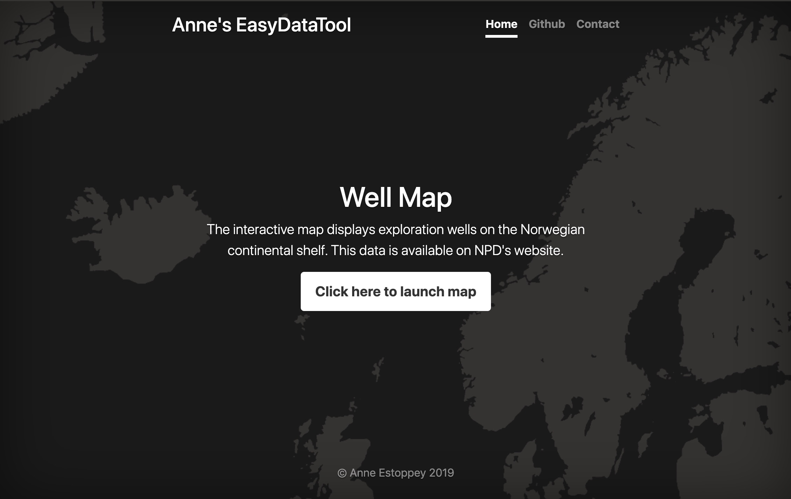

# flask-folium-app
By developing this app, we wished to accomplish the following:

1. Create a version 1 of an interactive well map with Folium.

2. Gain experience with the full path from a Jupyter Notebook, to a Flask app, to deployment.

PLEASE NOTE: the app is not presently online due to costs. We have deployed this app on DigitalOcean during a limited time to test it.

# Project description
The well data map shows the position of all exploration wellbores on the Norwegian shelf. Wellbores are grouped into clusters when zooming out. By clicking on a wellbore position, a popup comes up with additional information. 

 
    
    
    
 

Additionally, there is a contact form where users can contact us with comments/suggestions.

# Data
The dataset is in the form of a shapefile which is publicly hosted by the Norwegian Petroleum Directorate, [here.](https://www.npd.no/en/about-us/information-services/available-data/map-services/)

# Future developments
* Add map functionalites and features (solve display slowness issues for polygons)
* Make website secure (https:)

# Jupyter notebook to WebApp pipeline
Note: this pipeline is one of the many possibilities how to transform a Jupyter notebook into a web app, and deploy it. There are many other solutions. Here is the main steps we follow:

* open Jupyter notebook in **Visual Code Studio**. Clean the code (cells, comments, etc). Add functions.
* create file structure for **Flask** app (app.py, templates, static)
* add **bootstrap** for UI design
* add button and menu functionalities (UI/UX)
* create contact form with **Flask-WTF and Flask-mail**
* testing and more testing on localhost
* create **requirements.txt**
* create **DOCKERFILE**
* create **github repo** for web app files
* add a new project and droplet on **DigitalOcean**
* set up SSH access on remote
* clone repo on remote
* create **DOCKER container** on remote
* **LAUNCH APP!**

# References
**Flask app howtos** 
https://explore-flask.readthedocs.io/en/latest/organizing.html 
https://pythonhow.com/your-first-flask-website/

**Folium in Flask** 
https://python-visualization.github.io/folium/flask.html

**Contact form with Flask-WTF and Flask-mail** 
https://code.tutsplus.com/tutorials/intro-to-flask-adding-a-contact-page--net-28982 
https://www.youtube.com/watch?v=48Eb8JuFuUI

**Docker** 
https://towardsdatascience.com/how-to-deploy-your-machine-learning-web-app-to-digital-ocean-64bd19ce15e2 
https://www.fullstackpython.com/blog/develop-flask-web-apps-docker-containers-macos.html

